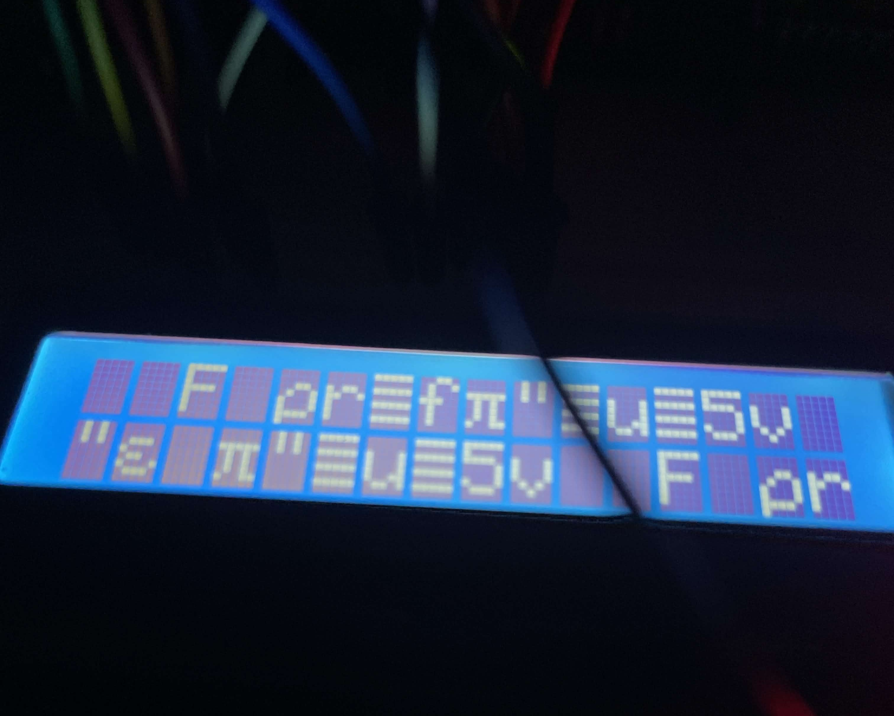
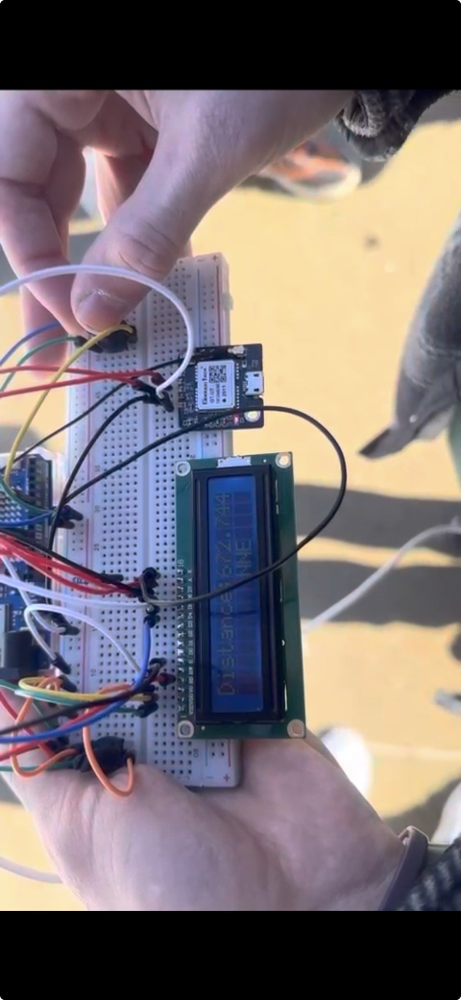

##### btw this was (mostly) made at approximately 4:30AM  
## The build progression:

got the LCD working at 9:30PM  

 

had to be tested outside or in a car in 15° weather, but we finally got a location reading at ~2AM

 

### also, the compass was originally supposed to be put together with copper PCB plates for a more polished product, but the milling machine was not cooperative and that idea had to be scrapped.  

the machine in question (actually really cool but we couldn't use)  
  
 

there were some hiccups with printing properly  

final (for hackathon) product working & demonstrated at 11:00AM

